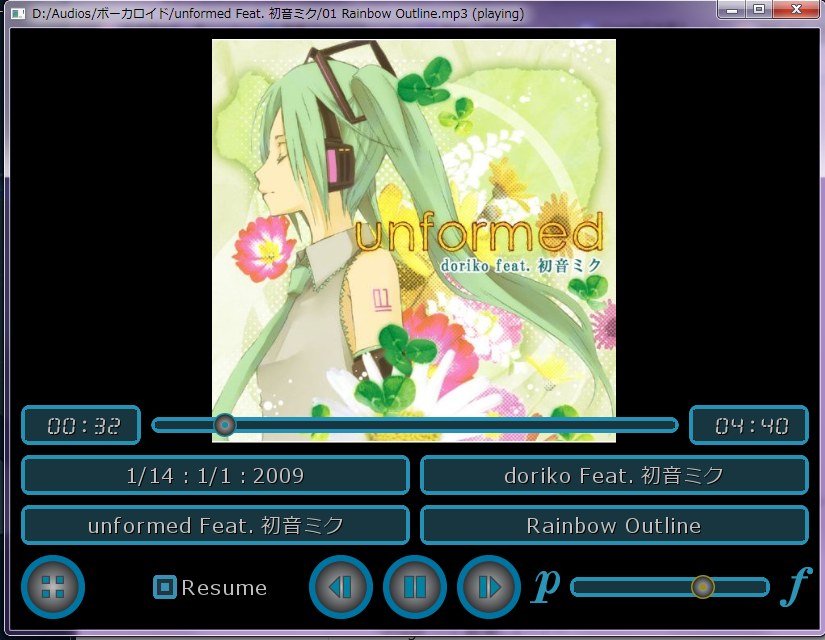
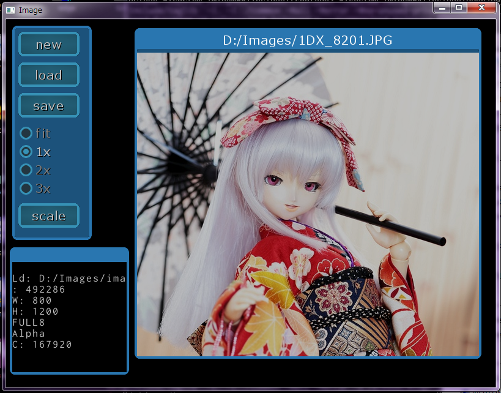
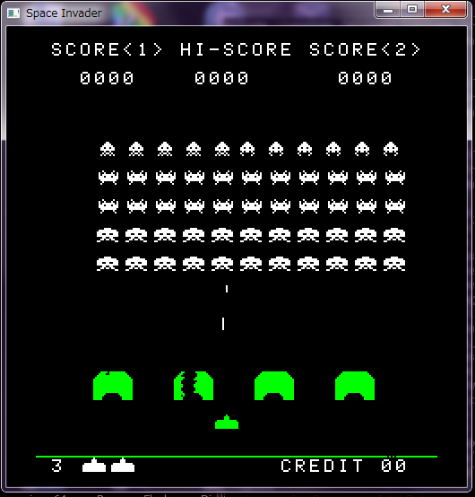
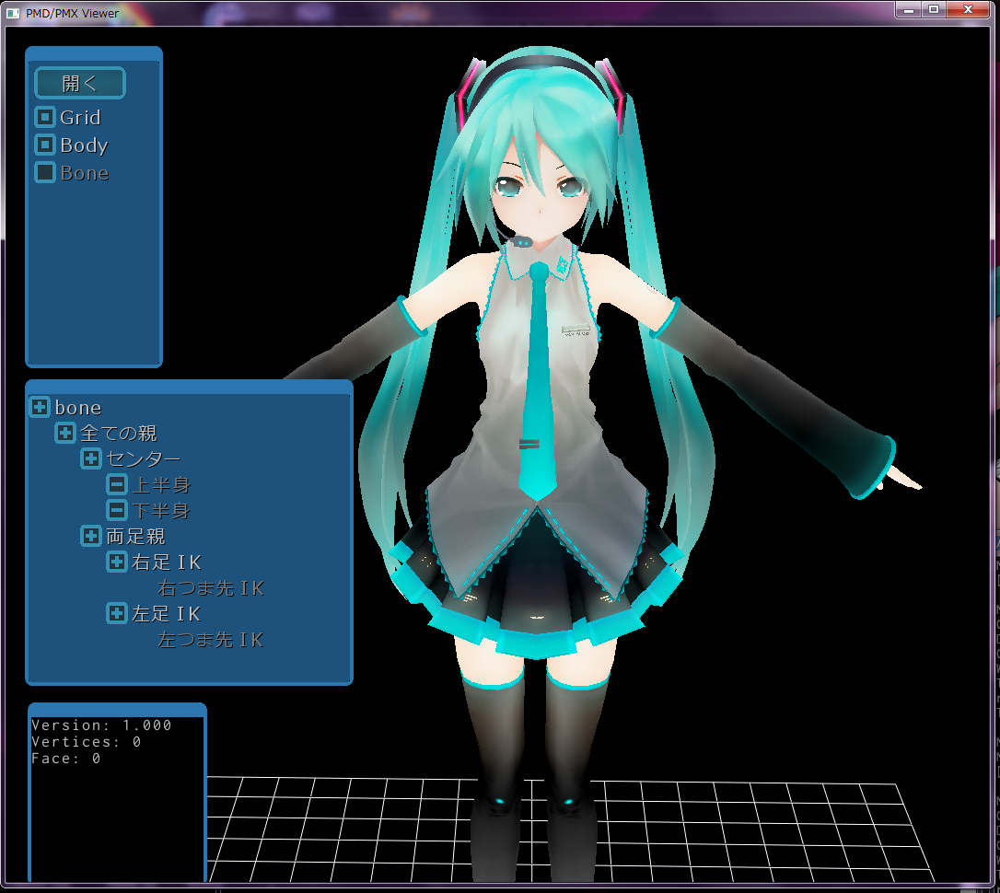

glfw3_app
=========

GLFW application

## glfw_app の概要

・glfw ライブラリーを使って動作するアプリケーションと、OpenGL ベースの GUI フレームワークとユーティリティー類です。  
・img_io は画像ファイルの入出力や、画像の操作を網羅するモジュールです。  
・snd_io は音楽ファイルの入出力や、OpenAL を使った音の再生を行うモジュールです。  
・utils は、文字列の操作、二次元、三次元、四次元ベクトル、行列を扱う数学クラスなどがあります。  

###開発環境（OS-X）

・macports をインストール、各種ライブラリーをインストールして下さい。  

###開発環境（Windows）

・msys2、mingw64 環境で開発を行います。  
・pacman で必要なパッケージをインストールして下さい。  
・pacman -S 「パッケージ名」

###必要なライブラリー（パッケージ名）

・mingw-w64-x86_64-clang / clang   
・mingw-w64-x86_64-glfw / glfw   
・mingw-w64-x86_64-openal / openal  
・mingw-w64-x86_64-freetype / freetype  
・mingw-w64-x86_64-glew / glew  
・mingw-w64-x86_64-libjpeg-turbo / libjpeg-turbo  
・mingw-w64-x86_64-openjpeg2 / openjpeg  
・mingw-w64-x86_64-libpng / libpng  
・mingw-w64-x86_64-faad2 / faad2  
・mingw-w64-x86_64-libmad / libmad  
・mingw-w64-x86_64-taglib / taglib  
・mingw-w64-x86_64-ffmpeg / ffmpeg  

###全体のソース・コード取得
```
   git clone git@github.com:hirakuni45/glfw3_app.git
```

###各ディレクトリーの構成

・common  --->  フレームワーク、ラッパー

###コンパイル方法
・各ディレクトリーに移動後、「make」を行なう。   
・従属規則は自動で生成される。   

####便利ツール   

・dllcollect  --->  mingw64 DLL 収集プログラム   
・bmc  --->  ビットマップ変換   
・iod_make  --->  組み込みマイコン向け、I/O デバイスクラステンプレート生成サポート   

####アプリケーション   

・gui_test  --->  GUI 描画、操作、テスト用   
・player  --->  音楽再生プレイヤー   
   
・image  --->  画像ビューアー   
        
・vplayer  --->  動画再生プレイヤー(ffmpeg)   
・spinv  --->  スペースインベーダーエミュレーター（ROM イメージ別途必要）   
   
・pmdv  --->  MMD プレイヤー 
     
・effv  --->  effekseer プレイヤー   

---
License

MIT
