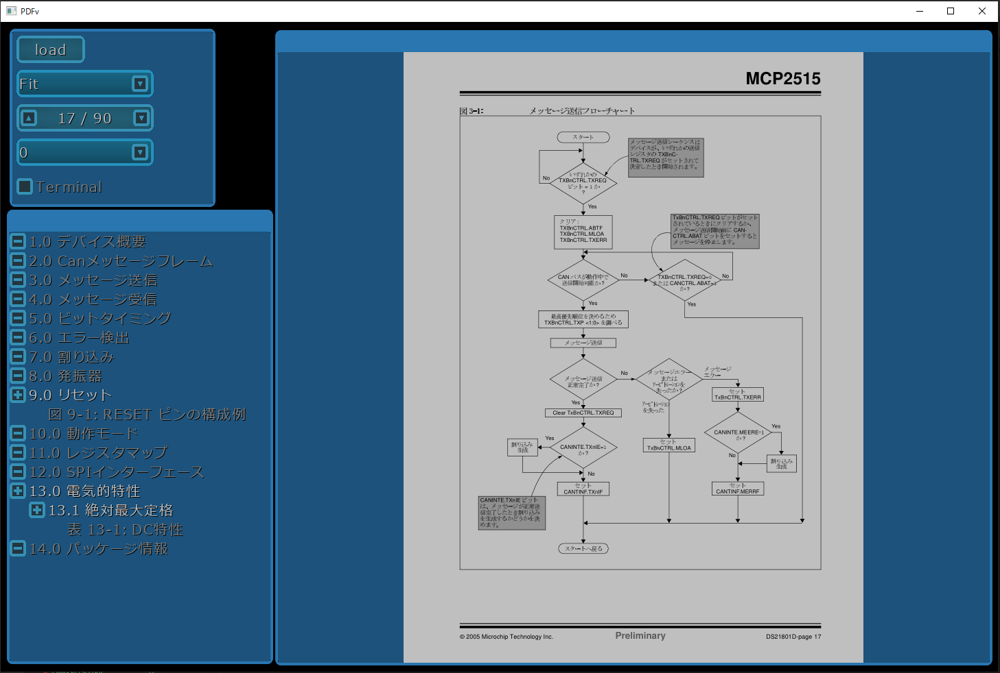
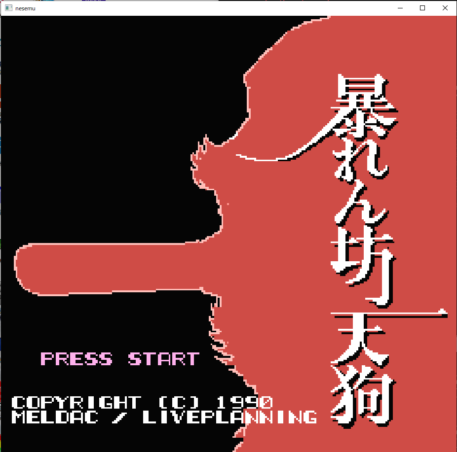

glfw3_app
=========

GLFW application

## glfw_app の概要

- glfw ライブラリーを使って動作するアプリケーションと、OpenGL ベースの GUI フレームワークとユーティリティー類です。  
- img_io 画像ファイルの入出力や、画像の操作を網羅するモジュールです。  
- snd_io 音楽ファイルの入出力や、OpenAL を使った音の再生を行うモジュールです。  
- utils 文字列の操作、二次元、三次元、四次元ベクトル、行列を扱う数学クラスなどがあります。  
- gl_fw OpenGL API 関係の C++ ラッパーなど。
- core glfw API 関係の C++ ラッパー、フォントの描画関連など。
- widgets GUI フレームワークなど
- av ffmpeg API 関係の C++ ラッパー
   
---

## 開発環境（Windows）
   
 - Windows では、事前に MSYS2 環境をインストールしておきます。
 - MSYS2 には、msys2、mingw32、mingw64、clang64、ucrt64 と複数の異なった環境がありますが、この   
   プロジェクトでは、clang64 環境で行います。 
   
 - msys2 のアップグレード
 - アップグレードの方法がバージョンアップに伴い変更になる場合等あります、詳しくは、   
   MSYS2 のホームページを参照の事。

```
   pacman -Syu
```

 - コンソールを開きなおす。（コンソールを開きなおすように、メッセージが表示されるはずです）

```
   pacman -Su
```
 - アップデートは、複数回行われ、その際、コンソールの指示に従う事。   
 ※複数回、コンソールを開きなおす必要があるかもしれない。
 - clang でのコンパイル時は、「clang-tools-extra」を別途インストールする必要があるようです。
 - 「faad2」はバージョンアップに伴い、同梱されていた「mp4ff」ライブラリが無くなっている為   
   AAC 関係のコーデックがコンパイル出来なくなり、とりあえず、リンクから外しました。

```
   pacman -S gcc
   pacman -S make
   pacman -S git
   pacman -S tar
   pacman -S zip
   pacman -S unzip
   pacman -S mingw-w64-clang-x86_64-clang
   pacman -S mingw-w64-clang-x86_64-boost
   pacman -S mingw-w64-clang-x86_64-glfw
   pacman -S mingw-w64-clang-x86_64-freetype
   pacman -S mingw-w64-clang-x86_64-glew
   pacman -S mingw-w64-clang-x86_64-libjpeg-turbo
   pacman -S mingw-w64-clang-x86_64-openjpeg2
   pacman -S mingw-w64-clang-x86_64-libpng
   pacman -S mingw-w64-clang-x86_64-faad2
   pacman -S mingw-w64-clang-x86_64-libmad
   pacman -S mingw-w64-clang-x86_64-zlib
   pacman -S mingw-w64-clang-x86_64-ffmpeg
   pacman -S mingw-w64-clang-x86_64-mupdf-libmupdf
   pacman -S mingw-w64-clang-x86_64-gumbo-parser
   pacman -S mingw-w64-clang-x86_64-jbig2dec
   pacman -S mingw-w64-clang-x86_64-harfbuzz
```

- 好みのテキストエディターをインストール。   
※自分の場合は「emacs」、最近、コンソールベースで使え、日本語も正しく   
表示（mintty 設定を参照）できます。

```
  pacman -S emacs
```

- 最近は、マルチプラットホームで使え、インテリセンスも使えるので [VSCode](https://code.visualstudio.com/) がお勧め。

---

## 開発環境（OS-X）

・macports をインストール、各種ライブラリーをインストールして下さい。  
   
```
   sudo port install clang
   sudo port install boost
   sudo port install glfw
   sudo port install openal
   sudo port install freetype
   sudo port install glew
   sudo port install libjpeg-turbo
   sudo port install openjpeg
   sudo port install zlib
   sudo port install libpng
   sudo port install faad2
   sudo port install libmad
   sudo port install ffmpeg
   sudo port install mupdf-libmupdf
   sudo port install gumbo-parser
   sudo port install jbig2dec
   sudo port install harfbuzz
```

---

## 開発環境（Ubuntu）

Linux 環境は、複数あるので、ここでは「Ubuntu 16.04 LTS」環境の場合を書いておきます。
```
   sudo apt-get install xxx
```

---

## フォントのインストール

GUI フレームワークでは、「Inconsolata」の OTF フォントを使っています。   
ダウンロードして、インストールして下さい。   
※Windows 環境では、ファイルを選択して、右ボタンを押して、メニューからインストールできます。
   
<a href="http://levien.com/type/myfonts/inconsolata.html" target="_blank">Inconsolata OTF font</a>   
   
※Linux 環境では、apt−get 等でインストールできます。

```
   sudo apt-get install fonts-inconsolata
```

---

## コンソールの設定（mintty の設定）
   
コンソールフォントのインストール（必要なら・・）   
mintty では、日本語と英字を美しく表示できるように、日本語フォントを   
インストールしておきます。   
お勧めは「MyricaM」ですが、他にも色々あるので、好みのフォントを   
インストールできます、その場合、「.minttyrc」のフォント設定を修正します。   
   
<a href="https://myrica.estable.jp/myricamhistry/" target="_blank">Myrica M</a>   
   
・mintty の設定ファイルをホームディレクトリーに「.minttyrc」として置きます。   
※「Term」設定で、「xterm-256color」にしている情報がありますが、間違いです、   
サポートされていません、バックスペースが正しく動かなくなるので、設定しないで下さい。   
```
# mintty Settings
BoldAsFont=no
Font=MyricaM M
FontHeight=12

Columns=110
Rows=36
Locale=ja_JP
Charset=UTF-8
Term=xterm-256color

CopyOnSelect=yes
BackspaceSendsBS=yes

IMECursorColour=255,0,0
```

---

## 全体のソース・コード取得

```
   git clone git://github.com/hirakuni45/glfw3_app.git
```

---

## コンパイル方法

- 各ディレクトリーに移動後、「make」を行なう。   
- 従属規則は自動で生成されます。
- 「make strip」とする事で、アプリ起動時に作成される、コンソールウィンドウを作らなくなります。

### コンソールアプリケーション

- dllcollect  --->  clang64 DLL 収集プログラム   
- 実行ファイルに必要な、DLL を「dlls」ディレクトリーに全てコピーする。
- この DLL とアプリケーション(.exe）を合わせて配布が可能。

```
   dllcollect 「実行ファイル名」 
```

- bmc  --->  ビットマップ変換

### サンプル・アプリケーション

- gui_test  --->  GUI 描画、操作、テスト用

---

- player  --->  音楽再生プレイヤー
   

---

- image  --->  画像ビューアー
        

---

- pdfv  ---> Mupdf ライブラリを使った PDF ビューア


---

- pmdv  --->  MMD プレイヤー 


---

- nesemu ---> NES エミュレータ（ROM イメージ別途必要）
        

---

- spinv  --->  スペースインベーダーエミュレーター（ROM イメージ別途必要）

   
---
License

MIT
